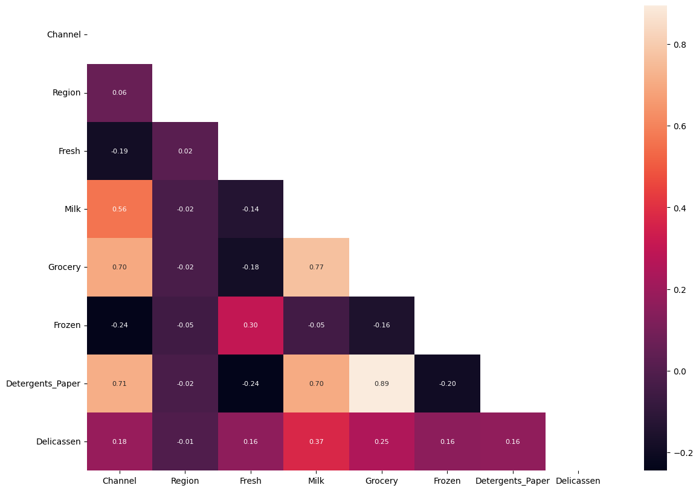
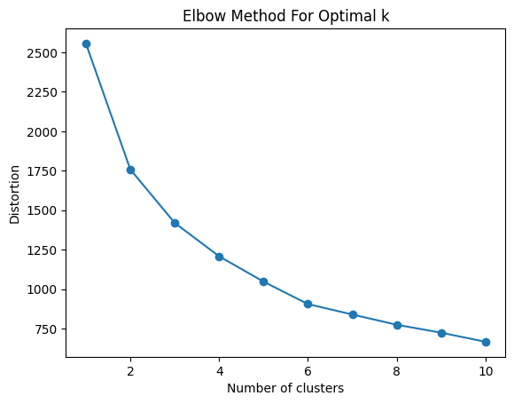
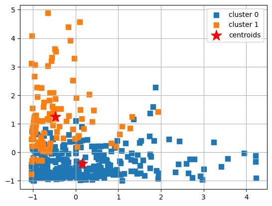
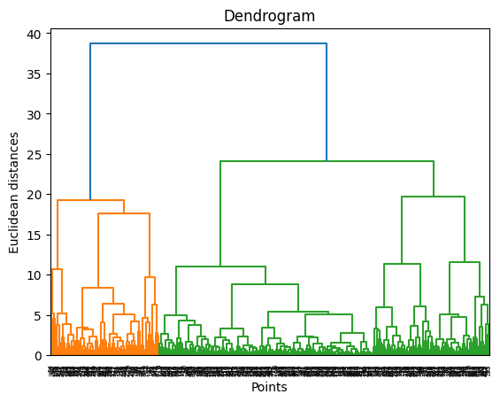
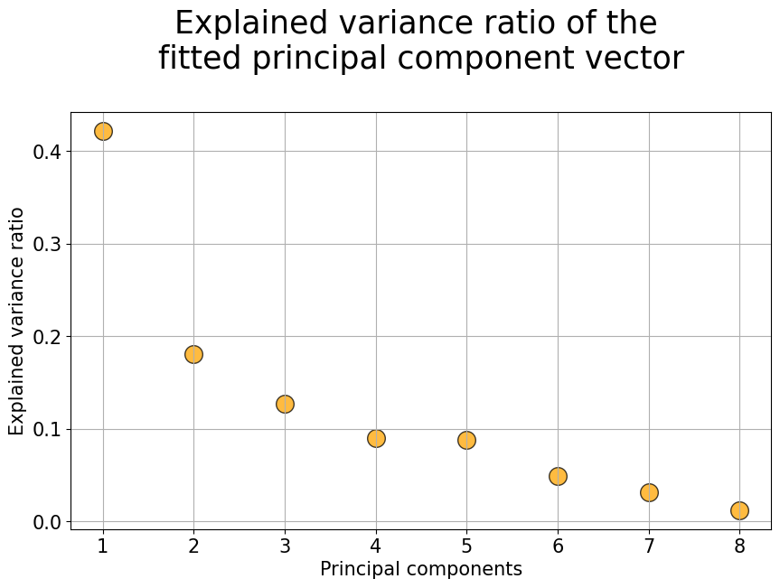

# LHL-Unsupervised-Machine-Learning-Project

Created by: Ken Wall

## Goals
To apply unsupervised learning techniques to a real-world data set and use data visualization tools to communicate the insights gained from the analysis. To gain insights from the data sets and communicate these insights to stakeholders using appropriate visualizations and metrics to make informed decisions based on the business questions asked.

## Project Description

<p>
The data set for this project is the "Wholesale Data" dataset containing information about various products sold by a grocery store. The project will involve the following tasks:

- Exploratory data analysis and pre-processing: We will import and clean the data sets, analyze and visualize the relationships between the different variables, handle missing values and outliers, and perform feature engineering as needed.
- Unsupervised learning: We will use the Wholesale Data dataset to perform k-means clustering, hierarchical clustering, and principal component analysis (PCA) to identify patterns and group similar data points together. We will determine the optimal number of clusters and communicate the insights gained through data visualization.
</p>

## Process

### Part 1 - Exploratory Data Analysis (EDA)

<p>The 'Wholesale' dataset was provided to our part of the project containing one csv file with 8 features related to sales data of a wholesale distributor's sales to customers.

1. channel
2. region
3. milk
4. grocery
5. fresh
6. frozen
7. detergents paper
8. delicassen

I imported and cleaned the data, checked for outliers. Performed visualization and correlation testing.

There were multiple outliers across different features which were detected during cleaning and visualization.



- Detergents paper had the highest correlations with Milk (0.7) and Grocery (0.89)
- Milk also had a high correlation with Detergents paper (0.7) and Grocery (0.77) and mild correlation with Delicassen (0.37)
- all others had week correlation between each other 
</p>

### Part 2 - KMeans Clustering

<p>The objective of the analysis is to group similar products together into clusters based on their attributes such as fresh, milk, grocery, frozen, detergents_paper, and delicatessen.</p>

<p>The following function definition was used to create a visualization of the distorition for the 'elbow rule' to determine the optimal number of clusters.</p>

```
def plot_distortion(X, max_clusters=10):
    distortions = []
    for i in range(1, max_clusters + 1):
        km = KMeans(n_clusters=i, init='k-means++', n_init=10, random_state=0)
        km.fit(X)
        distortions.append(km.inertia_)
        
    plt.plot(range(1, max_clusters + 1), distortions, marker='o')
    plt.xlabel('Number of clusters')
    plt.ylabel('Distortion')
    plt.title('Elbow Method For Optimal k')
    plt.show()
```






### Part 3 - Hiearchical Clustering

<p>Hierarchical clustering is a popular unsupervised machine learning algorithm that is used to identify patterns and group similar data points together in a hierarchy. The algorithm works by iteratively merging or splitting clusters based on a similarity measure until a dendrogram is formed. I used a dendogram to determine the ideal number of clusters</p>

```
ac = AgglomerativeClustering(metric='euclidean',
                             linkage='ward',
                             n_clusters = 2)

y_hc = ac.fit_predict(scaled_data)
plot_clusters(scaled_data,y_hc)
```

<p>The following function definition was used to create a visualization of the dendogram to determine the optimal number of clusters.</p>

```
# define plot_dendrogram function
def plot_dendrogram(X,method ='ward'):
    dendrogram = sch.dendrogram(sch.linkage(X, method=method))
    plt.title("Dendrogram")
    plt.ylabel("Euclidean distances")
    plt.xlabel('Points')
    plt.show()

```



<p>As can be seen be the plot above the groupings with the longest vertical lines is two, indicating two is the optimal number of clusters.</p>

### Part 4 - Principal Component Analysis (PCA)

<p>I performed principal component analysis (PCA) to draw conclusions about the underlying structure of the wholesale customer data. Since using PCA on a dataset calculates the dimensions which best maximize variance, I will find which compound combinations of features best describe customers.</p>

```
# Initialize the StandardScaler
scaler = StandardScaler()

# Fit the scaler on the data and transform it
scaled_data = scaler.fit_transform(data)

pca = PCA(n_components=None) 
dfx_pca = pca.fit_transform(scaled_data)

pca.explained_variance_ratio_
```

<p>I then plotted to determine variance ratio of the unfitted principal component vector using the following code:</p>

```
plt.figure(figsize=(10,6))
plt.scatter(x=[i+1 for i in range(len(pca.explained_variance_ratio_))],
            y=pca.explained_variance_ratio_,
           s=200, alpha=0.75,c='orange',edgecolor='k')
plt.grid(True)
plt.title("Explained variance ratio of the \nfitted principal component vector\n",fontsize=25)
plt.xlabel("Principal components",fontsize=15)
plt.xticks([i+1 for i in range(len(pca.explained_variance_ratio_))],fontsize=15)
plt.yticks(fontsize=15)
plt.ylabel("Explained variance ratio",fontsize=15)
plt.show()
```




### Part 5 - Conclusion

- EDA scatterplots of two variables indicated that both features had large clusters nearest to the origin and then spread out in both directions (x and y). There was no clear clustering.
- K-Means elbow rule indicated that 2 clusters was the optimal number and this was corroborated with mulitple cluster grouping experiments.
- Hierarchical clustering dendogram also indicated 2 clusters was the optimal cluster groupings.
- PCA's variance ratio above shows that 60% of the information is contained in the first two principal compenents. Like K-Means' elbow rule the variance ratio indicates that there should be two principal components.

### Challenges

- PCA analysis

### Future Goals

1. Include additional data scraped from external sources
2. Further explore the low values of MU for some customers to see if they can be filled with a mean value
3. Try additional unsupervised learning techniques